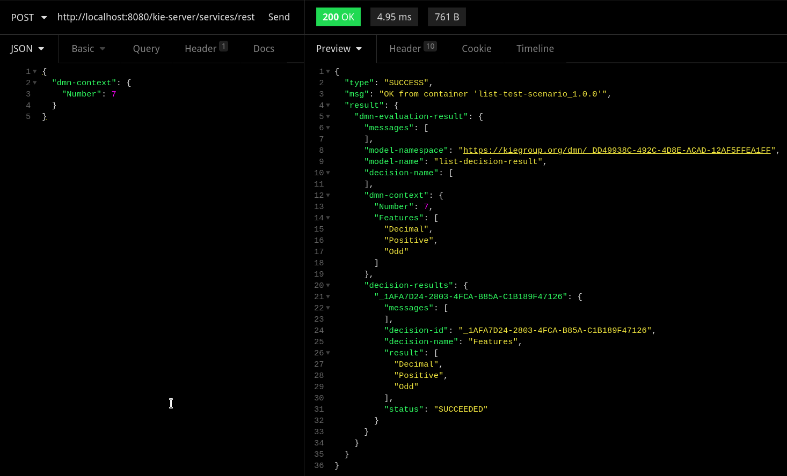
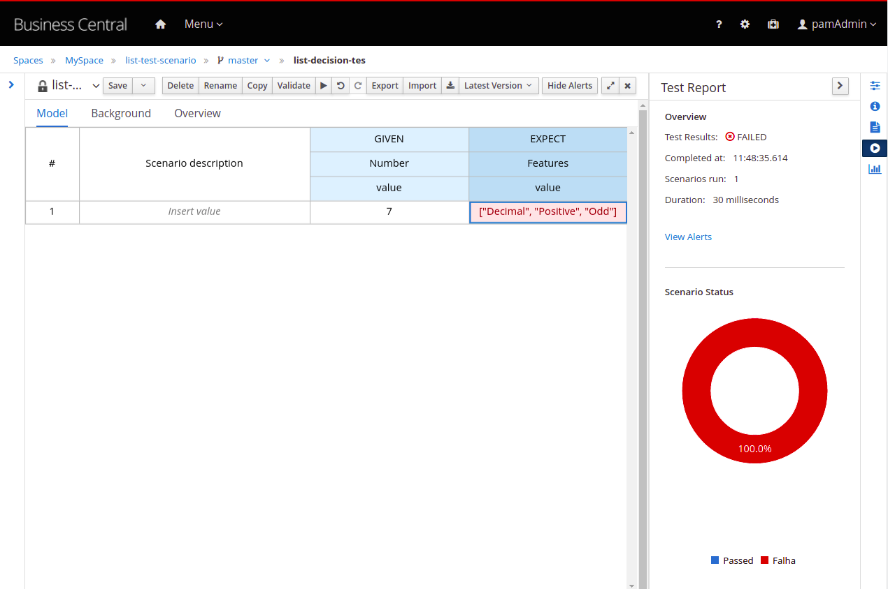

# Reproducer - DMN test scenario with list decision results

## Problem

I created a DMN Decision that has a List as a output (for this example a string list).

Calling the DMN using REST Endpoint

Test scenario with list as expected result

